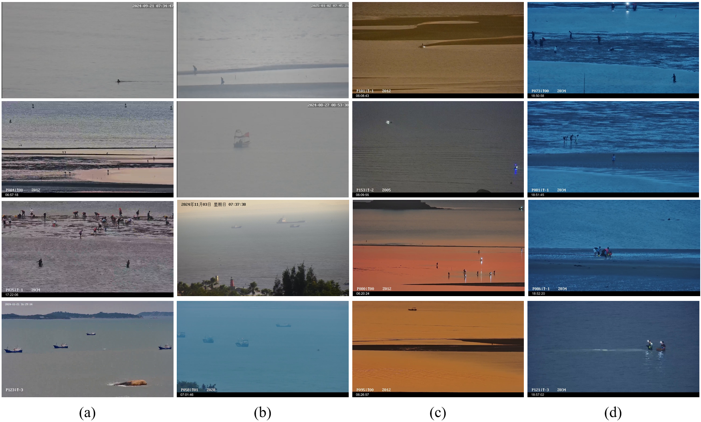

The dataset and code will be available soon.

# PGAI_VND
Visible Nearshore Object Detection: Dataset and Benchmark

# Abstract
Visible nearshore object detection plays a crucial role in intelligent surveillance, navigation safety, and water rescue. However, this task remains highly challenging due to factors such as small object sizes, interference from waves and complex background textures, as well as significant illumination variations. In addition, most existing studies primarily focus on ship detection, lacking comprehensive datasets that cover diverse nearshore object categories. To address these challenges, this paper presents a visible nearshore image dataset designed for nearshore environments. The dataset contains 20,934 images and is annotated with seven categories, including Pedestrian, Sailor, Swimmer, Ship, Boat, Flotage, and Seamark. Based on this dataset, we evaluate multiple mainstream object detection methods, providing essential data support and benchmark for the development and comparison of detection algorithms in nearshore scenarios. Furthermore, we propose a visible nearshore object detection network named VN-DETR, with improvements in both feature extraction and feature fusion. Experimental results demonstrate the superiority and effectiveness of the proposed method on the constructed dataset.

# Dataset
The dataset was collected using visible cameras along the nearshore regions of Fujian Province, China, spanning the period from August 2024 to September 2025. To ensure data quality and reduce redundancy, multiple rounds of rigorous screening were conducted to exclude images with significant overlapping or low information content. Ultimately, a visible nearshore object detection dataset comprising 20,934 images was constructed for subsequent analysis.

The visible images collected in this paper cover a wide range of real nearshore human activities, including swimming, boating, and fishing, thereby closely reflecting practical application scenarios. To enhance the diversity and challenge level of the dataset, we collect nearshore images in different weather and lighting conditions, mainly sunny, foggy, morning and evening. Representative scenarios and the typical data collected in this dataset can be summarized as follows: (1) Visible nearshore images collected under various weather conditions. Adverse environments such as sea fog and rainy weather severely degrade the imaging characteristics of objects in visible images by reducing image clarity and contrast. This often leads to darker image tones and the loss of fine-grained details, causing objects to appear blurred or even invisible. (2) Visible nearshore images captured under different illumination conditions. Even within the same region, variations in illumination conditions can lead to significant changes in brightness, contrast, and color distribution. For example, under strong illumination, intense sea-surface reflections may cause local overexposure that obscures object details. In contrast, under low-light or backlighting conditions, the overall image brightness decreases, resulting in blurred object boundaries and weakened feature representation. (3) Visible nearshore images captured from different viewing perspectives. Visible nearshore images acquired using cameras with different focal lengths contain objects of varying scales and imaging angles. Long-focus lenses can capture objects at long distances, allowing them to occupy a larger proportion of the image, although with a narrower field of view. In contrast, short-focus lenses provide a wider scene coverage, but the object size becomes relatively smaller.

