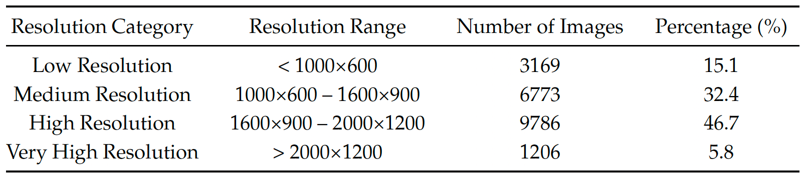
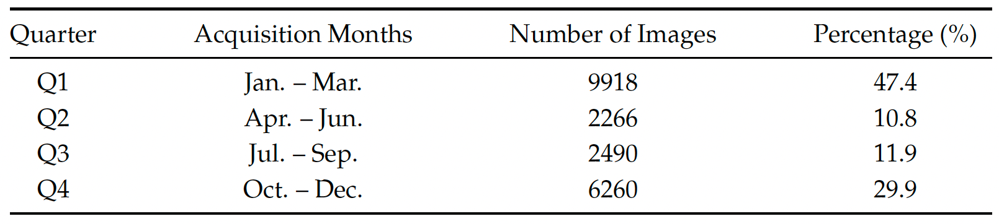
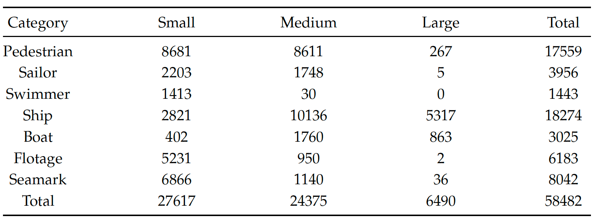
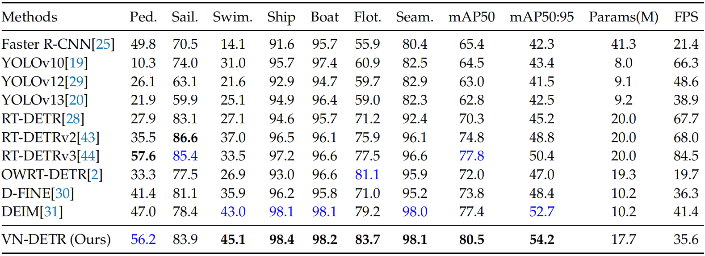

The dataset and code will be available soon.

# PGAI_VND
Visible Nearshore Object Detection in Overhead Coastal Surveillance Imagery: A Large-Scale Dataset and Benchmark

# Dataset

## Dataset Overview

Visible Nearshore Dataset is a large-scale object detection benchmark designed for real-world nearshore monitoring scenarios. It contains **20,934 images** and **58,482 annotated instances**, covering seven fine-grained categories: **Pedestrian, Sailor, Swimmer, Ship, Boat, Flotage, and Seamark**.

Unlike existing maritime datasets that mainly focus on vessels, this dataset jointly models **human activities, vessels, floating objects, and navigation marks** in complex coastal environments, providing a more comprehensive benchmark for visible nearshore object detection.

### Key Features

- **Large-scale nearshore data**  
  The dataset contains 20,934 images collected from real nearshore regions, with 58,482 bounding-box annotations.

- **Seven fine-grained categories**  
  The dataset covers pedestrians on coastal land, sailors on vessels, swimmers in water, ships, boats, floating objects, and seamarks.

- **Real-world coastal scenes**  
  Images include ocean areas, beaches, rocky shores, islands, and ports, reflecting practical surveillance and rescue scenarios.

- **Overhead-view surveillance perspective**  
  The dataset is built from fixed coastal monitoring images captured from an elevated overlooking perspective. This view is representative of real nearshore surveillance systems and introduces distinctive scale changes, partial occlusion, and dense object layouts.

- **Year-round seasonal coverage**  
  The dataset spans approximately one full year, covering all four seasons. This long-term collection captures seasonal variations in coastal appearance, human activity patterns, weather, illumination, and sea-surface conditions.
- **Diverse weather and illumination conditions**  
  The dataset includes sunny, foggy, morning, evening, low-light, backlit, and reflection-affected scenes.

- **Wide resolution range**  
  Image resolutions vary from **640 x 370** to **2560 x 1440**, covering low-, medium-, high-, and very-high-resolution samples.

- **Strong small-object challenge**  
  Many objects appear at long distances or are partially submerged/occluded, especially swimmers, sailors, pedestrians, flotage, and seamarks.

- **Complex background interference**  
  Waves, sea-surface reflections, shoreline textures, haze, and low contrast introduce substantial false-detection and missed-detection challenges.

- **Benchmark-ready split**  
  The dataset is divided into training, validation, and test sets with approximately **7:2:1**, while maintaining category distribution across subsets.

Table 1. Distribution of image resolutions in the proposed dataset. 

Table 2. Temporal distribution of images in the proposed dataset. 

Table 3. The size distribution of each object category. 

Fig. 1. Examples of case presentation from our dataset. 

# Experiments

Table 4. Comparison of different detection methods on the test set of the proposed dataset.

# Acknowledgments
This research was funded by the National Natural Science Foundation of China (Grant No. 62201404) and The Startup Foundation for Introducing Talent of NUIST (Grant No. 2024r061).

# Contact
Zhibin LIU  
Perceptual and Generative AI Lab (PGAI Lab)  
Nanjing University of Information Science and Technology  
Email: liuzhibin@nuist.edu.cn  

Kao ZHANG 
Perceptual and Generative AI Lab (PGAI Lab)  
Nanjing University of Information Science and Technology  
Email: kaozhang@nuist.edu.cn  
